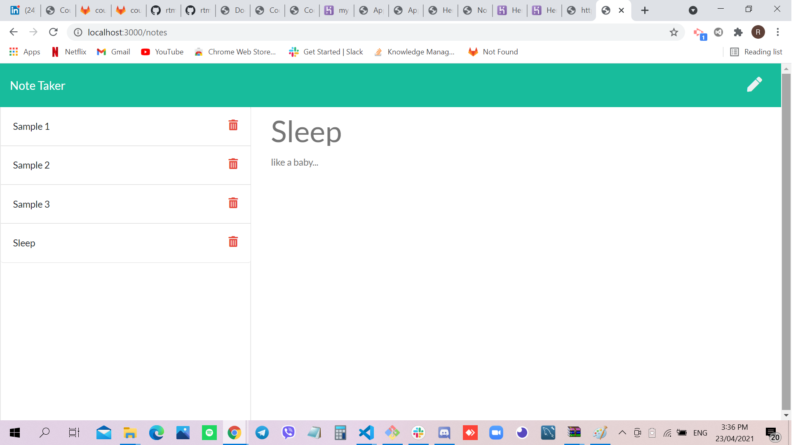

# Note Taker

## Site Picture


## Technologies Used
- Javascript - adds special effects on pages
- Node.js - an open source server environment that uses JavaScript on the server
- GitBash - for cloning repository and pushing code to GitHub
- GitHub - holds repository that deploys to GitHub Pages
- Heroku - a repository in the cloud 

## Summary
This file contains code to create a Note Taker wherein one can write and save notes on the browser . It also contains code that was created using Javascript and Node.js. 

## Code Snippet
```html
const express = require('express');
const app = express();
const port = 3000;

bodyParser = require('body-parser');
// support parsing of application/json type post data
app.use(bodyParser.json());

//support parsing of application/x-www-form-urlencoded post data
app.use(bodyParser.urlencoded({ extended: true }));

require('./routes/apiRoutes')(app);
require('./routes/htmlRoutes')(app);

app.listen(port, () => {
    console.log(`Example app listening at http://localhost:${port}`)
})
 ```

```html
<html>

</html>
```
## Author Links 
[LinkedIn](https://www.linkedin.com/in/rosario-miranda-b81170132/)<br />
[GitHub](https://github.com/rtmiranda18)

